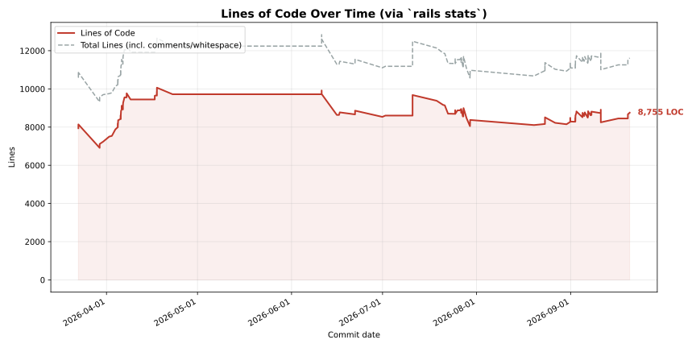

# LOC Stats

Auto-generated by the `loc-stats` GitHub Action. Do not edit by hand —
this branch is rewritten by CI.

- `loc_stats.csv` — raw data (one row per sampled commit)
- `loc_stats.png` / `loc_stats.svg` — rendered graph of lines of code over time

